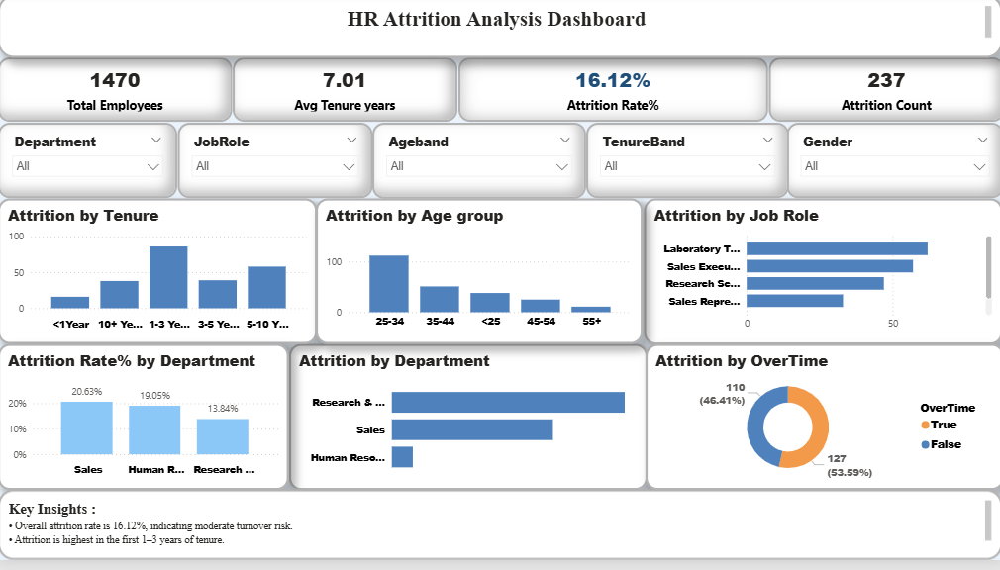

# HR Attrition Analysis (SQL + Power BI)

## 📌 Project Overview
This project analyzes employee attrition using an end-to-end data analytics approach.
Raw HR data was cleaned and transformed using **SQL**, and insights were visualized using an interactive **Power BI dashboard**.

---

## 🧹 Data Cleaning (SQL)
SQL was used to:
- Remove duplicate employee records
- Handle missing and inconsistent values
- Standardize department and job role names
- Create derived fields such as:
  - Age Group
  - Tenure Band
  - Attrition Flag

---

## 📊 Data Visualization (Power BI)
Power BI was used to create an interactive dashboard with:
- KPI cards (Total Employees, Attrition Rate, Avg Tenure)
- Attrition analysis by Age, Tenure, Department, Job Role, Gender, and Overtime
- Interactive slicers for filtering

---

## 🖼 Dashboard Preview

---

## 📂 Project Structure

HR_Attrition_Analysis/
├── powerbi/
│   └── HR_Attrition_Dashboard.pbix
├── data/
│   └── hr_attrition_cleaned.csv
├── images/
│   └── dashboard_preview.png
└── README.md

---

## 👤 Author
Santoshi

